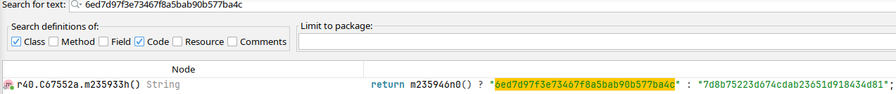
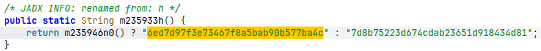
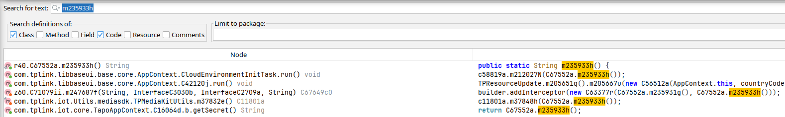
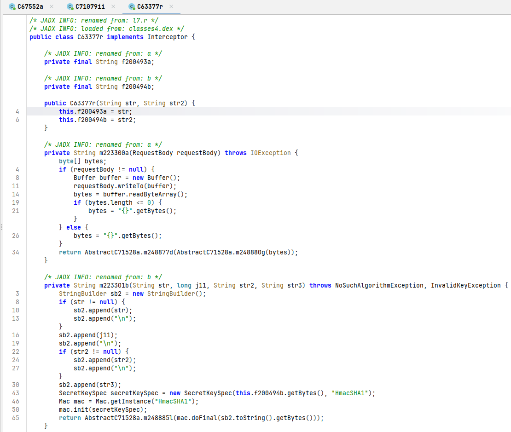
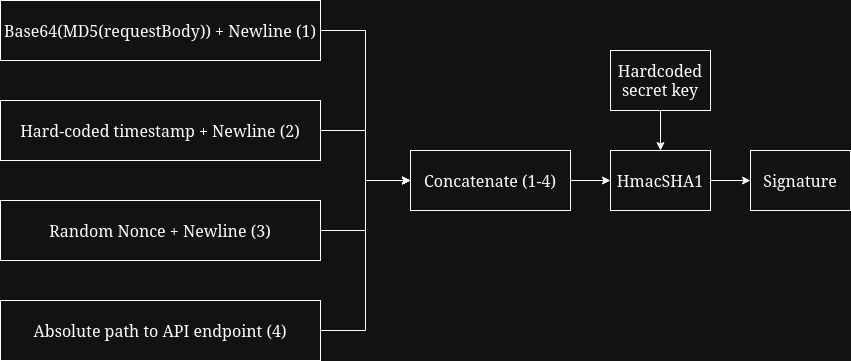
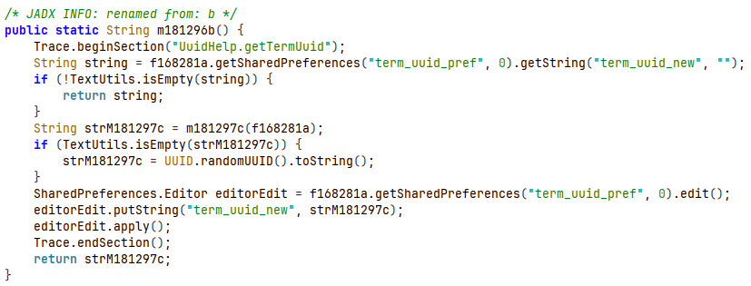
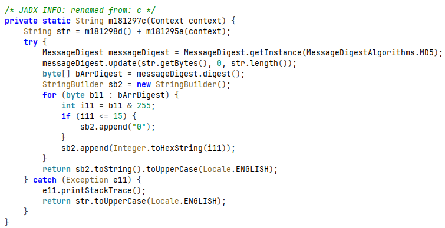
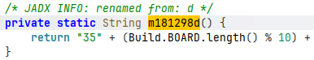

# TP-Link Tapo Android Application Security Analysis

Analyzing security methods of TP-Link Tapo Android application for personal account and data protection.

Table of Contents
=================
* [Prerequisites](#prerequisites)
* [Initial Analysis](#initial-analysis)
* [Pulling Application Files](#pulling-application-files)
* [Static Analysis of Signature Algorithm](#static-analysis-of-signature-algorithm)
    * [Code Analysis With JADX](#code-analysis-with-jadx)
    * [Signature Algorithm](#signature-algorithm)
* [Dynamic Analysis of Signature Algorithm](#dynamic-analysis-of-signature-algorithm)
    * [Frida Hook for Intercepting HTTP Request Signatures](#frida-hook-for-intercepting-http-request-signatures)
* [TermID Algorithm](#termid-algorithm)
* [Impact](#impact)
* [Python Implementations](#python-implementations)

# Prerequisites

***DISCLAIMER:*** This research has been conducted on the devices that I own (TP-Link Tapo C100 + smartphone) and my personal TP-Link account. All the intercepted traffic touches only my own account/device pairing. The goal of this research was to understand how did the authentication mechanism protect my personal account and data.

Tools that were used (JADX for static code analysis and Frida for dynamic analysis at runtime):

1. JADX decompiler, installed on host machine.
2. `frida-server`, installed on my rooted Android device ([my custom helper script can be found by following this link](https://github.com/KostasEreksonas/android_analysis/blob/main/scripts/install_frida)).
3. Frida client installed on a host machine via a package manager (e.g. `uv`).

# Initial Analysis

Relevant network traffic was collected with Wireshark and TP-Link's SSL pinning was bypassed while leveraging Frida's instrumentation toolkit and [masbog's Android SSL Re-Pinning script](https://codeshare.frida.re/@masbog/frida-android-unpinning-ssl/), hooked onto Tapo v3.19.607. This allowed to enumerate TP-Link API endpoints, payloads, URL and it's parameters, as well as how signature and termID is being incorporated into the HTTP request. Also, a login request was captured with a response to it containing authorization token for sensitive information access - more about that [on Impact section](#impact).

For analyzing the application (and cryptography research in general), I created a Javascript Frida hook - [which can be found by following this link to the project's Github repository](https://github.com/KostasEreksonas/android_analysis/blob/main/hooks/crypto_discovery.js) - that overloads multiple methods in Base64, Cipher and Mac Java classes, logging relevant cryptographic data and payload preview (both plaintext and encrypted/encoded) in a JSON format. Overloaded methods include:

1. Cipher:
    * getInstance()
    * init()
    * update()
    * doFinal()
2. Mac:
    * getInstance()
    * init()
    * update()
    * doFinal()
3. Base64:
    * encode()
    * encodeToString()
    * decode()

During cryptographic data collection (spawning Tapo Android application with the aforementioned Frida hook attached), the following Mac operation was captured:

```json
{
  "objectId": "Mac-164946758",
  "timestamp": 1787406387352,
  "instanceOverload": "1. [Mac.getInstance(java.lang.String) -> static Mac]",
  "transformation": "HmacSHA1",
  "algorithm": "HmacSHA1",
  "runtimeClass": "javax.crypto.Mac",
  "providerName": "AndroidOpenSSL",
  "providerVersion": 1,
  "providerInfo": "Android's OpenSSL-backed security provider",
  "providerClass": "com.android.org.conscrypt.OpenSSLProvider",
  "updateCount": 1,
  "updates": [
    "46365a47373637556462796750435a624855765546673d3d0a393939393939393939390a36613963616364352d623339 ... [56 more bytes]"
  ],
  "initOverload": "1. [Mac.init(Key key) -> void]",
  "macLength": 20,
  "keyClass": "javax.crypto.spec.SecretKeySpec",
  "keyAlgorithm": "HmacSHA1",
  "keyFormat": "RAW",
  "keyBytesString": "6ed7d97f3e73467f8a5bab90b577ba4c",
  "keyBytesFingerprint": "1eb62507:32",
  "updateOverload": "1. [Mac.update(byte[] input) -> void]",
  "finalOverload": "1. [Mac.doFinal() -> byte[]]",
  "bytesWritten": 20,
  "output": "41d55eea6002588e6ff213340d441e11a9ea2c85",
  "outputFingerprint": "f782e0dd:20",
}
```

The interesting value here is `6ed7d97f3e73467f8a5bab90b577ba4c` - [as per ad1s0n's dev.to article](https://dev.to/ad1s0n/reverse-engineering-tp-link-tapos-rest-api-part-1-4g6), this HMAC secret key is hardcoded into the Tapo application (later this was confirmed by doing static analysis with JADX).
# Pulling Application Files

1. List relevant packages:

```sh
adb shell pm list packages | grep <package-name>
```

2. Get full path name for the package with `adb shell pm path <package-name>`:

```
package:/data/app/~~s-<base64-string>/<package-name>-n_K_-<base64-string>/base.apk
package:/data/app/~~s-<base64-string>/<package-name>-n_K_-<base64-string>/split_asset_pack.apk
package:/data/app/~~s-<base64-string>/<package-name>-n_K_-<base64-string>/split_config.arm64_v8a.apk
package:/data/app/~~s-<base64-string>/<package-name>-n_K_-<base64-string>/split_config.en.apk
package:/data/app/~~s-<base64-string>/<package-name>-n_K_-<base64-string>/split_config.xxhdpi.apk
```

Core application logic is stored in `base.apk` with assets and configs stored in separate .apk files. For the purposes of current research, only the base application file was analyzed.

3. Pull the `base.apk` to host machine:

```sh
adb pull /data/app/~~s-<base64-string>/<package-name>-n_K_-<base64-string>/base.apk
```

4. [A shell script that automates package pulling process can be found by following this link](https://github.com/KostasEreksonas/android_analysis/blob/main/scripts/pull_application).

# Static Analysis of Signature Algorithm

For static analysis, the targeted application needs to be pulled the Android device via `adb`.

## Code Analysis With JADX

1. Load `base.apk` into JADX.

2. Search for the hardcoded HMAC key:



3. Full function with the hardcoded HMAC key:



4. Search for `m235933h()` function and select `addInterceptor`:



5. Following the `C63377r()` object declaration shows decompiled methods where actual signature building happens:



One additional thing to note is that `C63377r(String str, String str2)` takes 2 arguments:

1. First argument is ***access key*** - separate hardcoded value, used as a part of X-Authorization header in a HTTP request (example of which is provided in a [Signature Algorithm](#signature-algorithm) section).
2. Second argument is ***secret key*** - already described in [initial analysis](#initial-analysis) section, used as a key for HTTP request signature derivation.

***Note:*** Short class and method identifiers - ids (e.g. l7.r) that JADX renames from - are obfuscated representations of real class/method names and change with every application version. For this analysis, version 3.19.607 of TP-Link Tapo application was used.

## Signature Algorithm

1. Signature function takes four parameters as input:
    * MD5 hash of a requestBody (usually a JSON payload) that is Base64 encoded.
    * Timestamp (equals `9999999999`, hardcoded into the Android application).
    * Random nonce, generated with `UUID.randomUUID().toString()`.
    * Path to the requested API endpoint.
2. Parameters are concatenated into a single line and separated by a newline symbol (\n).
3. Signature function outputs HmacSHA1 hash, derived from the mixture of concatenated parameter string and a secret key that is hardcoded into the Android application.

On a high level, the signature derivation scheme can look as follows:



For example, if the following HTTP request is captured:

```http
POST /api/v2/account/getMFAFeatureStatus?appName=TP-Link_Tapo_Android&appVer=3.19.607&netType=wifi&termID=<term-id>&ospf=Android%2012&brand=TPLINK&locale=en_GB&model=<smartphone-model>&termName=<smartphone-term-name>&termMeta=1&token=<token> HTTP/1.1
Content-MD5: mZFLkyvTelC5g8XnyQrpOw==
X-Authorization: Timestamp=9999999999,
                 Nonce=d78ef6b9-d1cb-4610-8219-589833f0c1f8,
                 AccessKey=<access-key>,
                 Signature=a7356d83df620ee3fa326151b212883c458e4d33
Content-Type: application/json; charset=utf-8
Content-Length: 2
Host: n-euw1-wap.i.tplinkcloud.com
Connection: Keep-Alive
Accept-Encoding: gzip
User-Agent: okhttp/4.11.0

{}
```

Then conceptually, the signature is built in the following way:

```python
signature = hmac.new(secretKey, str(Content-MD5 + "\n" + Timestamp + "\n" + Nonce + "\n" + "/api/v2/account/getMFAFeatureStatus"), sha1).hexdigest()
```

# Dynamic Analysis of Signature Algorithm

Dynamic analysis allows to intercept and analyze relevant methods during Android application's runtime.

## Frida Hook for Intercepting HTTP Request Signatures

In the Frida hook - available in this repository as [dynamic_analysis/signature.js](./dynamic_analysis/signature.js) - `C63377r` class is renamed to `SignatureInterceptor`, for the purpose of better readability. This hook overloads three methods of SignatureInterceptor class:

1. SignatureInterceptor.$init:
    * Loads `secret key` into a local variable.
    * Loads `access key` into a local variable. Also a hard coded value, used as a part of HTTP request X-Authorization header.
2. SignatureInterceptor.a:
    * Computes MD5 hash of requestBody.
    * Encodes MD5 hash with Base64.
3. SignatureInterceptor.b:
    * Takes 4 relevant parameters as input.
    * Computes HmacSHA1 hash as HTTP request signature.

For every captured signature a JSON object is generated with additional metadata, that include:

1. Content type.
2. Content length.
3. Content string (request body).
4. Encoded content string.
5. Timestamp.
6. Nonce.
7. API path.
8. Signature.
9. Request:
    * URL.
    * Request URL parameters.
10. Response:
    * Method.
    * Code.
    * Message.
    * Body.

If Frida is installed on the host machine via uv package manager, a sample command that spawns an Android application with signature intercepting hook attached could look like this:

```sh
uv run frida -U -f <package-name> -l signature.js
```

Or an updated version that saves both normal output (stdout) and errors (stderr) to a log file:

```sh
uv run frida -U -f <package-name> -l signature.js 2>&1 | tee signature.log
```

Example output from a successful run:

```json
{
  "threadId": "57820",
  "accessKey": "4d11b6b9d5ea4d19a829adbb9714b057",
  "secretKey": "6ed7d97f3e73467f8a5bab90b577ba4c",
  "contentType": "application/json; charset=UTF-8",
  "contentLength": "134",
  "contentString": "{\"appPackageName\":\"com.tplink.iot\",\"appType\":\"TP-Link_Tapo_Android\",\"tcspVer\":\"1.1\",\"terminalUUID\":\"55362BA0604DB15DDEF62C41C6D57E46\"}",
  "contentEncoded": "OipCDENZq7XgQ1RGH/EisA==",
  "timestamp": "9999999999",
  "nonce": "c76f5bda-f745-4390-99e6-3fdc0aab891a",
  "path": "/api/v2/common/helloCloud",
  "signature": "bd61941929ac354d19d4f3a8fe0b3445dddb3d9b",
  "request": {
    "method": "POST",
    "url": "https://n-wap.i.tplinkcloud.com/api/v2/common/helloCloud?appName=TP-Link_Tapo_Android&appVer=3.20.154&netType=wifi&termID=55362BA0604DB15DDEF62C41C6D57E46&ospf=Android%2016&brand=TPLINK&locale=en_US&model=Redmi%20Note%209&termName=Xiaomi%20Redmi%20Note%209&termMeta=1",
    "urlParameterNames": [
      {
        "name": "appName",
        "value": "TP-Link_Tapo_Android"
      },
      {
        "name": "appVer",
        "value": "3.20.154"
      },
      {
        "name": "netType",
        "value": "wifi"
      },
      {
        "name": "termID",
        "value": "55362BA0604DB15DDEF62C41C6D57E46"
      },
      {
        "name": "ospf",
        "value": "Android 16"
      },
      {
        "name": "brand",
        "value": "TPLINK"
      },
      {
        "name": "locale",
        "value": "en_US"
      },
      {
        "name": "model",
        "value": "Redmi Note 9"
      },
      {
        "name": "termName",
        "value": "Xiaomi Redmi Note 9"
      },
      {
        "name": "termMeta",
        "value": "1"
      }
    ],
    "headers": [
      {
        "name": "signature-required",
        "value": "true"
      },
      {
        "name": "Content-Type",
        "value": "application/json;charset=UTF-8"
      }
    ],
    "tags": "com.tplink.cloud.api.ProtocolV2Api.helloCloud() [com.tplink.cloud.bean.protocol.params.HelloCloudParams@20dbac0]"
  },
  "response": {
    "protocol": "http/1.1",
    "code": 200,
    "message": "OK",
    "body": "{\"error_code\":0,\"result\":{\"tcspStatus\":1}}"
  }
}
```

# TermID Algorithm

Full Javascript code that logs the process of building a termID [can be accessed by following this link](./dynamic_analysis/termId.js). However, let's contextualize it a bit first.

In JADX-decompiled code, `AbstractC50389m.m181296b()` is the method that computes and returns `termID`:



As the first thing, this method queries `SharedPreferences["term_uuid_pref"]["term_uuid_new"]` for a cached termID value. If a cached value is found, method returns it ***without*** falling back to generation logic. Since the test device already has a termID cached, cache check needs to be bypassed. The following code snippet does just that - it returns an empty value instead of an actual termID:

```js
SharedPreferencesImpl.getString.overload('java.lang.String', 'java.lang.String').implementation = function (key, defValue) {
    if (key === 'term_uuid_new') { return ''; }
    return this.getString(key, defValue);
};
```

Method `m181297c(Context context)` is the actual place where termID is being built:


Two strings are being concatenated together:

1. `m181298d()` method:
    * Initializes the result string as "35".
    * Takes 13 different fields (BOARD, BRAND, CPU_ABI, etc. - each as a String object) of build information about the Android device running Tapo application.
    * Computes length of String object.
    * Appends last digit (or only digit if String.length() < 10) to the result string.
2. `m181295a(Context context)` takes Android ID from the device that runs Tapo application.
3. Resulting string equals `m181298d() + m181295a(Context context)`.
4. TermID equals hex-encoded and uppercased MD5 hash of the concatenated result string.


`m181298d()` method in JADX:



`m181295a(Context context)` method in JADX:



The aforementioned custom Frida hook produces a JSON lot that captures termID building process:

```json
{
  "header": 35,
  "board": {
    "name": "mt6768",
    "length": 6,
    "lastDigit": "6"
  },
  "brand": {
    "name": "Redmi",
    "length": 5,
    "lastDigit": "5"
  },
  "cpu_api": {
    "name": "arm64-v8a",
    "length": 9,
    "lastDigit": "9"
  },
  "device": {
    "name": "merlinx",
    "length": 7,
    "lastDigit": "7"
  },
  "display": {
    "name": "lineage_merlinx-userdebug 16 BP2A.250605.031.A2 eng.androi.20250916.075845 test-keys",
    "length": 84,
    "lastDigit": "4"
  },
  "host": {
    "name": "r-cca484a1fca13862-f3pp",
    "length": 23,
    "lastDigit": "3"
  },
  "id": {
    "name": "BP2A.250605.031.A2",
    "length": 18,
    "lastDigit": "8"
  },
  "manufacturer": {
    "name": "Xiaomi",
    "length": 6,
    "lastDigit": "6"
  },
  "model": {
    "name": "Redmi Note 9",
    "length": 12,
    "lastDigit": "2"
  },
  "product": {
    "name": "lineage_merlinx",
    "length": 15,
    "lastDigit": "5"
  },
  "tags": {
    "name": "release-keys",
    "length": 12,
    "lastDigit": "2"
  },
  "type": {
    "name": "user",
    "length": 4,
    "lastDigit": "4"
  },
  "user": {
    "name": "android-build",
    "length": 13,
    "lastDigit": "3"
  },
  "buildInfo": "356597438625243",
  "androidId": "988583252ee0bd24",
  "fullString": "356597438625243988583252ee0bd24",
  "termID": "55362BA0604DB15DDEF62C41C6D57E46"
}
```

# Impact

Being able to generate termID and HTTP request signature independently allows anyone who extracts hardcoded keys from Tapo application to craft a valid HTTP request to the TP-Link's API. Also, the hardcoded keys seem to persist between Tapo versions ([v3.7.113 was used in ad1s0n's article]() and both v3.19.607 for signature algorithm analysis and v3.20.154 for termID derivation were used in this repo).

However, upon a successful login request, the API returns a server-generated authorization token (which is uniquely generated for each user and each new session), which has to be supplied as an additional URL parameter when requesting sensitive personal information, for example:
1. Account details.
2. Personal devices paired with the account:
    * Video stream / recordings.
    * Notifications.
    * Configurations.
    * Updates.

Without authorized access, it is still possible to probe things like:
1. Probe status of a TP-Link cloud server.
2. Regional TP-Link cloud endpoint to use.

The authorization token is being sent over a network session that is protected by TLSv1.3 and TP-Link SSL certificates pinned onto the Tapo application.

A couple of things to note:
1. ***For unauthorized requests:*** independently generating termID and HTTP request signature allows to craft valid HTTP requests for TP-Link API.
2. ***For authorized requests:*** `token=<unique-token>` needs to be added as an URL parameter. Otherwise, this HTTP request is identical to an unauthenticated request.

Note #2 implies that if a malicious actor manages to bypass TP-Link's certificate pinning and intercept the user login request (along with a response containing authentication token for that specific session), a ***completely valid and authorized*** HTTP request can be made to obtain the user's personal data.

In the end, the Hmac-SHA1 signature acts as a HTTP request integrity layer and termID is essentially a fingerprint of a device that issued the request. Sensitive information access protection relies on TLS, certificate pinning and the server-issued session token, none of which were bypassed in this research.

On the last note, [the replay script in sample_scripts directory](./sample_scripts/replay.py) retrieves a fresh access token for the provided TP-Link account credentials and demonstrates that the account's username and password is the only two pieces of information necessary to craft valid and authenticated HTTP requests to TP-Link API endpoints. However, it is important to emphasize that this sensitive data travels over a network via TLSv1.3 session and is further protected by TP-Link's SSL/TLS certificates pinned into it's Android application. 

# Python Implementations

Python implementation of HTTP request signature building algorithm, termID derivation and HTTP request replay to TP-Link API are available in [The sample_scripts directory](./sample_scripts/) includes Python scripts for:
1. HTTP request signature computation.
2. TermID derivation.
3. Replaying HTTP POST requests to TP-Link API.